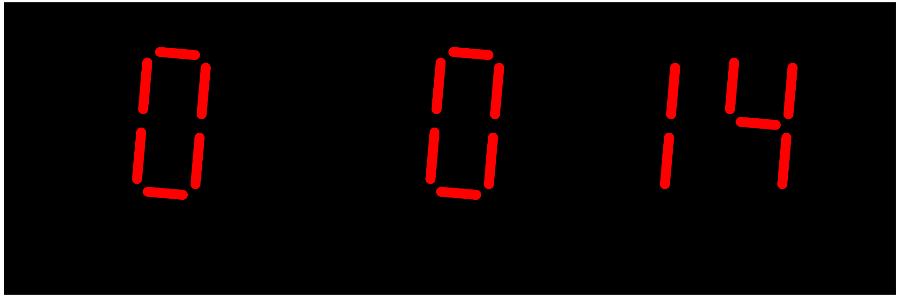
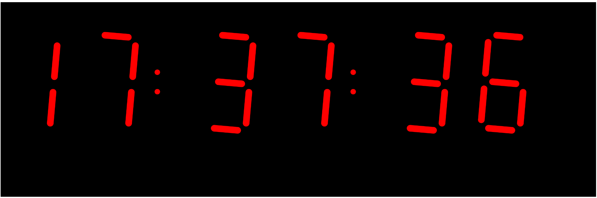
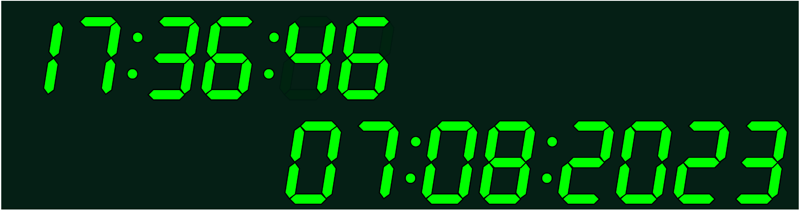

# Seven Segment Display

## Timer

A timer was implemented in JavaScript using the p5.js library. It displays the current time as a digital clock with animated segments.

### How it Works

The code uses the p5.js library to create a canvas and render the timer. The setup function initializes the canvas and sets the frame rate. The `draw` function is responsible for updating the timer display.

The `displayTime` function takes a value (hours, minutes, or seconds) and renders it using the `drawSegment` and `drawColon` functions. The `drawSegment` function draws individual segments of the digits based on the provided value and the nums array. Each digit is represented by seven segments, labeled from A to G.

The `getColor` function determines the color of a segment based on the value and the shift. If the corresponding bit is set in the value, the segment is filled with red; otherwise, it is black.

The `drawColon` function draws the colon separator between the minutes and seconds digits. It alternates between a filled colon and an empty colon every second.

The code fetches the current time by calculating the elapsed time since the start of the program using the millis function. The elapsed time is then converted into hours, minutes, and seconds using mathematical calculations. These values are passed to the displayTime function to render the clock.

## Clock

A clock was implemented in JavaScript using the p5.js library. It displays the current time as a digital clock with animated segments.

### How it Works

The code uses the p5.js library to create a canvas and render the clock. The `setup` function initializes the canvas and sets the frame rate, while the `draw` function is responsible for updating the clock display.

The `displayTime` function takes a value (hours, minutes, or seconds) and renders it using the `drawSegment` and `drawColon` functions. The `drawSegment` function draws individual segments of the digits based on the provided value and the `nums` array.

The `drawColon` function draws the colon separator between the minutes and seconds digits. It alternates between a filled colon and an empty colon every second.

The code fetches the current time from the system using the `Date` object in JavaScript. The `getHours()`, `getMinutes()`, and `getSeconds()` methods are used to retrieve the hours, minutes, and seconds values, respectively.

Timer

Clock

Date and Time

# References:
- https://www.youtube.com/watch?v=MlRlgbrAVOs&t - The Coding Train Coding Challenge #117: Seven-Segment Display
- https://editor.p5js.org/Khaley4/sketches/By3E58MsX